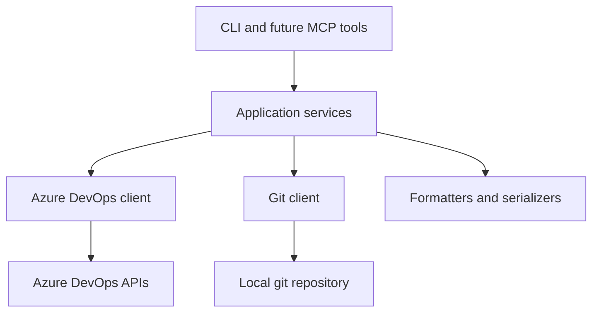

# Architecture Direction

This document describes how to keep the current CLI useful while making the codebase easier to extend into a companion skill and, later, an MCP server.

## Recommendation

Keep the CLI as the source of truth.

Add a skill first.

Add an MCP wrapper later, only after the business logic is separated from command-line printing and process exits.

Keep the outer product surface under the `Singularity` product name while making the internals progressively provider-neutral enough for GitLab to become the second concrete adapter.

## Current shape

The repository currently has a strong implementation surface but a flat structure:

- `./sg` is the thin launcher for the product surface.
- `sg.py` is the main CLI entrypoint.
- review and PR-oriented command wiring now has a first dedicated command module in `cli_commands/review.py`.
- work-item and evidence-oriented command wiring now also has a dedicated command module in `cli_commands/work_items.py`.
- build-oriented command wiring now lives in `cli_commands/builds.py`, and `doctor` now lives in `cli_commands/doctor.py`.
- command modules now depend on provider contracts rather than importing Azure DevOps helpers directly.
- process exits are now centralized in `sg.py`; lower layers increasingly raise typed errors instead.
- Tests cover a useful subset of helper behavior and command surfaces.

That is a good prototype shape and a poor long-term integration shape.

## Why not jump straight to MCP

The current code is organized around interactive CLI behavior:

- command handlers print directly to stdout
- the entrypoint still converts typed failures into CLI exit codes
- transport, formatting, and mutation logic are interleaved
- several commands assume local git context and a human-readable terminal

An MCP server wants a different contract:

- typed inputs
- structured outputs
- predictable error objects
- side effects isolated behind explicit tool calls

You can wrap the current CLI in MCP, but the result will be brittle and harder to maintain than the current local helper.

## Why a skill fits sooner

A skill is a workflow and usage layer, not a replacement for the implementation.

This project already has the right behavior for a skill to orchestrate:

- inspect the item
- fetch attachments when UI context matters
- ask for clarification if requirements are incomplete
- move the item to In Progress only when ready
- create the PR when validation is complete
- follow up on review threads

That means a skill can increase reliability now without forcing an immediate rewrite.

## Why `sg.py` And `azure-devops-workflow.md` Still Exist

Provider-neutral architecture does not mean every provider-specific workflow note should disappear.

The intended shape is:

- keep `./sg` as the neutral operator entrypoint
- keep Azure DevOps-specific adapters under `providers/azure_devops/`
- move workflow logic, contracts, and reusable models toward provider-neutral internals

That lets Singularity stay concrete and useful for the current Azure DevOps integration while still making GitLab a realistic second provider later without rewriting the core behavior.

## Target shape

Refactor toward three layers.



  ## Provider-neutral contracts

  Keep the workflow opinionated while making the internals portable.

  The goal is not to genericize every CLI command today. The goal is to define a stable workflow layer that can sit above provider adapters.

  ### Workflow layer

  This is where Singularity stays differentiated. It should answer questions like:

  - is the item clear enough to start
  - what branch and change-request metadata should be proposed
  - what review threads still require follow-up
  - when the work should move to review or testing

  ### Provider interfaces

  These contracts should describe the workflow needs without naming Azure DevOps directly:

  - `WorkTrackingProvider`
  - `EvidenceProvider`
  - `ReviewProvider`
  - `BuildProvider`

  Example responsibilities:

  - load a work item or issue
  - list comments and attachments
  - transition workflow state
  - resolve a repository and create a change request
  - inspect changed files and review threads
  - list or queue build runs

  ### Provider-neutral models

  Normalize only what the workflow actually needs. Good examples are:

  - `Sprint`
  - `CandidateWorkItem`
  - `TrackedWorkItem`
  - `StartWorkPlan`
  - `ChangeRequest`
  - `ReviewChangeSummary`
  - `ReviewThread`
  - `BuildRun`
  - `TriageReport`

  Avoid forcing premature universal terminology into the CLI. The current ADO commands can keep their names while the internals move toward provider-neutral models.

  ### First migration step

  Start with internal models that preserve current behavior while reducing Azure DevOps-specific coupling.

  The first low-risk slice was the canonical start planning flow:

  - normalize the work-item fields needed to propose a branch and change-request draft
  - keep the existing CLI output stable
  - only convert the neutral model back to the current dictionary shape at the CLI boundary

  That lets the codebase prove the abstraction with a real path before attempting a GitLab provider.

  Current implemented slices:

  - start planning through `TrackedWorkItem` and `StartWorkPlan`
  - read-only work-item inspection through a concrete `WorkTrackingProvider` adapter boundary
  - work-item state transitions through the same `WorkTrackingProvider` adapter boundary
  - sprint lookup, ready-item candidate lookup, triage reporting, and work-item comment posting through the same `WorkTrackingProvider` adapter boundary
  - repository listing and change-request planning/creation through the PR-side provider boundary
  - PR summary/status/reviewer inspection through `ChangeRequest` and a concrete `ReviewProvider` adapter boundary
  - PR review-thread inspection through `ReviewThread` and `ReviewComment`
  - PR thread comment, inline comment, reply, edit, and resolve mutations through the same `ReviewProvider` adapter boundary
  - build listing/status snapshots through `BuildRun`-style models and a concrete `BuildProvider` adapter boundary
  - build queueing and pending approval actions through the same `BuildProvider` adapter boundary
  - attachment and screenshot inspection/download through a concrete `EvidenceProvider` adapter boundary
  - work-item summary/comment/development-link shaping through workflow models behind the existing CLI output
  - every external mutation through immutable `MutationPlan` envelopes and Git-worktree-identity-bound, short-lived, one-shot SHA-256 approval IDs

  Current adapter placement:

  - `sg.py` remains the Python CLI entrypoint behind the thin launchers
  - `cli_commands/work_items.py` now owns the work-item command family plus its parser wiring
  - `cli_commands/review.py` now owns the PR/review command family plus its parser wiring
  - `cli_commands/builds.py` now owns the build command family plus its parser wiring
  - `cli_commands/doctor.py` now owns doctor reporting, while `sg.py` keeps thin compatibility wrappers and top-level dispatch
  - command-level tests now target the `cli_commands/*` owners directly; `sg.py` is no longer the preferred internal seam for those behaviors
  - provider-neutral contracts live in `providers/interfaces.py`
  - Azure DevOps work-tracking, evidence, review, and build adapters now live under `providers/azure_devops/`
  - Azure-specific transport and Azure CLI token acquisition now also live under `providers/azure_devops/`
  - the Azure DevOps helper implementations for pull requests, work items, and work-item context now live under `providers/azure_devops/`, and internal imports use those paths directly
  - provider-neutral runtime helpers now use names like `app_config.py` and `git_client.py` instead of `ado_` prefixes
  - `sg.py` still owns CLI parsing and command orchestration, but the read-only work-item inspection, start/state-transition, attachment inspection, PR inspection, and build inspection slices no longer fetch Azure DevOps data directly
  - `mutation_plans.py` owns canonical mutation envelopes, nonce-backed Plan IDs, payload-free local pending/used approval records, preview rendering, and exact one-shot apply validation

## Keep, generalize, or move

This is a file-by-file classification of what should stay Azure DevOps-specific, what is the reusable provider-neutral core, and where the naming boundaries sit.

### Keep as-is

These parts are intentionally Azure DevOps-specific because they are the current product surface or the current concrete adapter.

| Area | Current files | Why keep as-is |
| --- | --- | --- |
| CLI entrypoint and launcher | `sg.py`, `sg` | The product benefits from a single neutral launcher as GitLab support grows; treat `sg.py` as the Python entrypoint and `./sg` as the launcher. |
| Workflow docs and examples | `azure-devops-workflow.md`, README examples, `.github/copilot-instructions.md`, `.github/skills/azure-devops-devloop/SKILL.md` | The workflow is opinionated around Azure DevOps work items, PRs, and builds; keep examples concrete instead of prematurely generic. |
| Provider implementation | `providers/azure_devops/` | This is the real delivery adapter and should stay explicit about the platform it talks to; new providers should mirror this area. |
| Provider-flavored command names | subcommands like `teams`, `create-pr`, `pr-comments`, `build-status` | The CLI solves a concrete provider-backed workflow today; neutral internals do not require fully generic command names. |

### Generalize

These parts are the reusable core and should keep becoming less provider-shaped.

| Area | Current files | Direction |
| --- | --- | --- |
| Workflow models | `workflow_models.py` | Continue normalizing only the fields the workflow actually needs. |
| Provider contracts | `providers/interfaces.py` | Keep contract names workflow-oriented, not transport-oriented. |
| Command modules | `cli_commands/review.py`, `cli_commands/work_items.py`, `cli_commands/builds.py`, `cli_commands/doctor.py` | Treat them as the internal command API; tests should target them directly. |
| Runtime support | `app_config.py`, `git_client.py`, `errors.py` | Keep config, git, and typed error handling provider-neutral. |
| Test seams | `tests/test_*.py` | Prefer direct module tests and reserve `test_sg.py` for parser/dispatch coverage. |

### Naming guidance

- Keep `sg.py` as the Python entrypoint and `./sg` as the user-facing launcher.
- Keep Azure DevOps-specific implementation under `providers/azure_devops/`.
- Keep provider-neutral runtime and workflow code on neutral names such as `app_config.py`, `git_client.py`, `errors.py`, and future `workflow/` modules.
- Do not add new top-level helper modules with `ado_` prefixes unless they are explicitly part of the outer CLI compatibility surface.

## Proposed module split

One reasonable extraction path is:

```text
singularity/
  __init__.py
  config.py
  errors.py
  models.py
  auth.py
  azure_devops_client.py
  git_client.py
  work_items.py
  pull_requests.py
  builds.py
  review_drafts.py
  formatting.py
  commands/
    sprint.py
    work_items.py
    pull_requests.py
    builds.py
    doctor.py
  cli.py
```

### Responsibilities

- `config.py`: environment variables, defaults, validation.
- `errors.py`: typed exceptions instead of ad hoc `print` plus `sys.exit`.
- `models.py`: normalized dataclasses or typed dicts for work items, repos, PRs, comments, and builds.
- `auth.py`: Azure token acquisition.
- `azure_devops_client.py`: raw HTTP calls and Azure DevOps endpoint wrappers.
- `git_client.py`: current branch, origin repo inference, and local git helpers.
- `work_items.py`: item inspection, comments, attachments, state transitions, triage.
- `pull_requests.py`: PR lookup, analysis, comments, diffs, and review thread actions.
- `builds.py`: build listing, status, queueing, approvals.
- `review_drafts.py`: draft bundle creation and apply flow.
- `formatting.py`: terminal text renderers plus JSON serializers.
- `commands/`: argument-to-service adapters for the CLI.
- `cli.py`: parser wiring only.

## Migration principles

- Keep command names and user-visible behavior stable while extracting internals.
- Move one vertical slice at a time.
- Prefer returning structured results from services and rendering them in command handlers.
- Replace `sys.exit` in core logic with typed exceptions and let the CLI convert them to exit codes.

Current first step on that boundary:

- repo and PR context resolution in `cli_commands/review.py` now raises a typed CLI error instead of printing and exiting directly, and `sg.py` converts that error into terminal output and exit code behavior.
- local git command failures now raise the same typed CLI error from `git_client.py` instead of exiting directly, so command modules can decide whether to surface or suppress that failure.
- command modules no longer terminate the process directly; `sg.py` is the exit boundary.

## Incremental plan

### Step 1: Extract the non-controversial foundations

- Move config, auth, and git helpers into dedicated modules.
- Add one shared error model.
- Leave command output unchanged.

### Step 2: Extract service slices

- Move work-item logic into a work-items service.
- Move PR logic into a pull-requests service.
- Move build logic into a builds service.
- Keep the CLI handlers thin.

### Step 3: Add structured boundaries

- Ensure each service returns structured objects.
- Ensure JSON output uses the same structured objects.
- Reduce direct printing inside non-command functions.

### Step 4: Add a companion skill

- Document when agents should run `show`, `comments`, `attachments`, `start`, `create-pr`, and review-thread commands.
- Keep the skill repo-local and opinionated.

### Step 5: Add MCP only if needed

- Expose the service layer as MCP tools.
- Map CLI operations to typed tool inputs and structured tool outputs.
- Reuse the same service layer rather than shelling out to the CLI.

## What I would not change yet

- Do not remove the CLI in favor of MCP.
- Do not try to generalize to every work-management platform before the internal boundaries are cleaner.
- Do not add an always-on autonomous runtime that bypasses the immutable preview/approval contract.

## What an MCP phase would look like

If you later need an MCP server, its tool surface should look like service functions, not terminal transcripts.

Examples:

- `get_current_sprint()`
- `list_ready_items()`
- `get_work_item_context(id)`
- `download_work_item_attachments(id, images_only)`
- `start_work_item(id)`
- `create_pull_request(work_item_id, repo, source, target, dry_run)`
- `list_pr_comments(url, unresolved_only)`
- `reply_to_pr_thread(url, thread_id, text, dry_run)`

That design only works well once the current command handlers are no longer the only place where behavior exists.

## Final recommendation

The right sequence is:

1. Keep the local CLI.
2. Keep the current Singularity-first command surface, with explicit provider workflow docs where they still help.
3. Add a skill for agent guidance.
4. Refactor further into a reusable core.
5. Add an MCP wrapper only when multiple clients need structured access.

That preserves what already works while creating a clean path toward broader automation.
